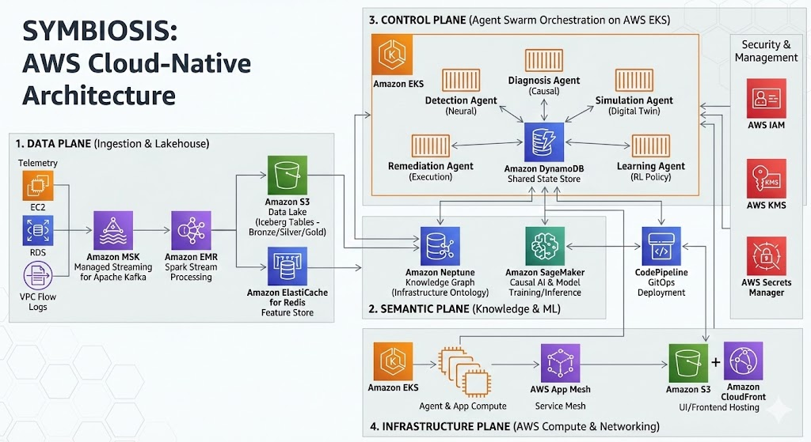

# SYMBIOSIS AWS Architecture Overview
## Self-Reinforcing Multi-Agent Brain for Orchestrating Intelligent Systems with Simulation

---

## Executive Summary

SYMBIOSIS is deployed on AWS as a cloud-native, serverless-first architecture designed for massive scale (1M+ events/sec), sub-second latency, and high resilience. The architecture follows AWS Well-Architected Framework principles across all five pillars: Operational Excellence, Security, Reliability, Performance Efficiency, and Cost Optimization.

---

## Architecture Diagram



*The Brain That Heals Your Infrastructure*

---

## Four Planes Architecture

### Plane 1: Data Plane (The Sensory System)

**Purpose:** Ingest, process, and store telemetry data at massive scale

| Component | AWS Service | Purpose | Scale |
|-----------|-------------|---------|-------|
| **Ingestion** | Amazon MSK | Managed Kafka for event streaming | 100K+ msg/s |
| **Processing** | Amazon EMR on EKS | Spark Structured Streaming & Batch | 1M+ events/s |
| **Lakehouse** | Amazon S3 + Iceberg | Unified storage with time travel | Petabytes |
| **Feature Store** | Amazon ElastiCache (Redis) | Low-latency feature serving | <10ms read |

**Data Flow:**
```
Telemetry Sources → MSK (Kafka) → EMR Spark → S3 Iceberg (Bronze/Silver/Gold)
                                          ↓
                                    ElastiCache Redis (Hot Features)
```

### Plane 2: Semantic Plane (The Knowledge Base)

**Purpose:** Transform raw data into contextual understanding

| Component | AWS Service | Purpose | Scale |
|-----------|-------------|---------|-------|
| **Knowledge Graph** | Amazon Neptune | Causal graph & ontology | 10M+ nodes |
| **ML Platform** | Amazon SageMaker | Training, inference, RL | Auto-scale |
| **GitOps/CD** | AWS CodePipeline + ArgoCD | Deployment automation | - |
| **Shared State** | Amazon DynamoDB | Agent workflow state | Millions of items |

**Knowledge Flow:**
```
S3 Data Lake → SageMaker (Causal Discovery) → Neptune (Knowledge Graph)
                                                    ↓
Agents Query ← Causal Reasoning ← Graph Embeddings
```

### Plane 3: Control Plane (The Agent Swarm)

**Purpose:** Reason, decide, and orchestrate autonomous actions

| Component | Technology | AWS Service | Latency |
|-----------|------------|-------------|---------|
| **Detection Agent** | PyTorch BNN | SageMaker Endpoint | <50ms |
| **Diagnosis Agent** | Causal Inference | Neptune + Lambda | <100ms |
| **Simulation Agent** | Monte Carlo | EKS + DynamoDB | <500ms |
| **Remediation Agent** | GitOps + APIs | EKS + CodePipeline | Varies |
| **Learning Agent** | Ray RLlib | SageMaker Training | Async |
| **Orchestration** | LangGraph | EKS (StatefulSets) | - |

**Decision Flow:**
```
Redis Feature Store → Detection → Diagnosis → Simulation → Remediation → Learning
                           ↓           ↓            ↓            ↓           ↓
                     SageMaker    Neptune    Digital Twin   GitOps     SageMaker
```

### Plane 4: Infrastructure Plane (The Target)

**Purpose:** Host the platform and manage target infrastructure

| Component | AWS Service | Purpose |
|-----------|-------------|---------|
| **Compute** | Amazon EKS | Kubernetes orchestration |
| **Auto-scaling** | Karpenter | Node provisioning |
| **Service Mesh** | AWS App Mesh | mTLS, traffic management |
| **Frontend Hosting** | S3 + CloudFront | React dashboard |

---

## AWS Service Selection Rationale

### Why Amazon MSK (Managed Kafka)?

| Criteria | MSK | Self-Hosted Kafka | Kinesis |
|----------|-----|-------------------|---------|
| **Operational Overhead** | Low (Managed) | High | Low |
| **Cost at Scale** | Moderate | High (Ops) | High |
| **Kafka Ecosystem** | Full | Full | Limited |
| **Schema Registry** | Yes (Glue) | Manual | No |
| **Cross-AZ HA** | Built-in | Manual | Built-in |

**Decision:** MSK provides the best balance of operational simplicity, cost, and Kafka ecosystem compatibility.

### Why Amazon EMR on EKS (vs EMR on EC2)?

| Criteria | EMR on EKS | EMR on EC2 | Glue |
|----------|------------|------------|------|
| **Kubernetes Integration** | Native | None | Limited |
| **Spot Instances** | Easy | Complex | N/A |
| **Custom Libraries** | Easy | Moderate | Limited |
| **Startup Time** | Fast (<1min) | Slow (5-10min) | Fast |
| **Cost** | Lower | Higher | Moderate |

**Decision:** EMR on EKS provides better integration with the EKS-based agent swarm and cost optimization through Spot instances.

### Why Amazon Neptune (vs Neo4j on EC2)?

| Criteria | Neptune | Neo4j EC2 | Neo4j Aura |
|----------|---------|-----------|------------|
| **Managed Service** | Yes | No | Yes |
| **AWS Integration** | Native | Manual | Limited |
| **Cypher Support** | Yes | Yes | Yes |
| **RDF/SPARQL** | Yes | Plugin | No |
| **IAM Auth** | Yes | No | Limited |
| **VPC Isolation** | Yes | Yes | No |

**Decision:** Neptune provides native AWS integration, managed operations, and supports both property graphs and RDF.

### Why Amazon SageMaker (vs Self-Hosted)?

| Criteria | SageMaker | EKS + Kubeflow | EC2 |
|----------|-----------|----------------|-----|
| **Managed Training** | Yes | Partial | No |
| **Auto-scaling Endpoints** | Yes | Complex | Manual |
| **Model Registry** | Built-in | Manual | Manual |
| **A/B Testing** | Built-in | Complex | Manual |
| **Cost** | Moderate | Lower | Lower |

**Decision:** SageMaker reduces operational overhead for model training, deployment, and monitoring.

---

## Data Flow Architecture

### Real-Time Streaming Flow

```
┌─────────────────────────────────────────────────────────────────────────────┐
│                         REAL-TIME DATA FLOW (<500ms)                        │
└─────────────────────────────────────────────────────────────────────────────┘

  ┌──────────────┐     ┌──────────────┐     ┌──────────────┐     ┌──────────────┐
  │   Source     │     │    MSK       │     │ Spark Stream │     │    Redis     │
  │  (Prometheus)│────►│   (Kafka)    │────►│   (EMR)      │────►│  (Features)  │
  │              │     │              │     │              │     │              │
  │ 100K msg/s   │     │ 3 brokers    │     │ Windowed     │     │ Hot features │
  │ Push model   │     │ 24 partitions│     │ Aggregations │     │ <10ms read   │
  └──────────────┘     └──────────────┘     └──────────────┘     └──────────────┘
                                                                          │
                                                                          ▼
                                                                   ┌──────────────┐
                                                                   │   Detection  │
                                                                   │    Agent     │
                                                                   │  (SageMaker) │
                                                                   └──────────────┘
```

### Batch Processing Flow

```
┌─────────────────────────────────────────────────────────────────────────────┐
│                         BATCH DATA FLOW (Hourly/Daily)                      │
└─────────────────────────────────────────────────────────────────────────────┘

  ┌──────────────┐     ┌──────────────┐     ┌──────────────┐     ┌──────────────┐
  │  S3 Iceberg  │     │ Spark Batch  │     │  SageMaker   │     │   Neptune    │
  │  (Raw Data)  │────►│   (EMR)      │────►│  (Training)  │────►│  (Updates)   │
  │              │     │              │     │              │     │              │
  │ Bronze layer │     │ ETL +        │     │ Causal       │     │ Graph        │
  │ Partitioned  │     │ Feature Eng  │     │ Discovery    │     │ Embeddings   │
  └──────────────┘     └──────────────┘     └──────────────┘     └──────────────┘
```

---

## Network Architecture

### VPC Design

```
┌─────────────────────────────────────────────────────────────────────────────┐
│                              AWS VPC (10.0.0.0/16)                          │
│                                                                             │
│  ┌─────────────────────────────────────────────────────────────────────┐   │
│  │                         Public Subnets                              │   │
│  │  ┌─────────────┐  ┌─────────────┐  ┌─────────────┐                 │   │
│  │  │    ALB      │  │   NAT GW    │  │   Bastion   │                 │   │
│  │  │  (Ingress)  │  │  (Outbound) │  │   (Jump)    │                 │   │
│  │  └─────────────┘  └─────────────┘  └─────────────┘                 │   │
│  │     10.0.1.0/24      10.0.2.0/24      10.0.3.0/24                  │   │
│  └─────────────────────────────────────────────────────────────────────┘   │
│                                                                             │
│  ┌─────────────────────────────────────────────────────────────────────┐   │
│  │                         Private Subnets (App)                       │   │
│  │  ┌─────────────┐  ┌─────────────┐  ┌─────────────┐                 │   │
│  │  │     EKS     │  │     MSK     │  │    EMR      │                 │   │
│  │  │   (Pods)    │  │  (Brokers)  │  │  (Spark)    │                 │   │
│  │  └─────────────┘  └─────────────┘  └─────────────┘                 │   │
│  │     10.0.10.0/24     10.0.11.0/24     10.0.12.0/24                │   │
│  └─────────────────────────────────────────────────────────────────────┘   │
│                                                                             │
│  ┌─────────────────────────────────────────────────────────────────────┐   │
│  │                         Private Subnets (Data)                      │   │
│  │  ┌─────────────┐  ┌─────────────┐  ┌─────────────┐                 │   │
│  │  │   Neptune   │  │   Redis     │  │  DynamoDB   │                 │   │
│  │  │   (Graph)   │  │  (ElastiCache)│  │   (State)   │                 │   │
│  │  └─────────────┘  └─────────────┘  └─────────────┘                 │   │
│  │     10.0.20.0/24     10.0.21.0/24     10.0.22.0/24                │   │
│  └─────────────────────────────────────────────────────────────────────┘   │
│                                                                             │
│  ┌─────────────────────────────────────────────────────────────────────┐   │
│  │                      VPC Endpoints (PrivateLink)                    │   │
│  │  ┌─────────────┐  ┌─────────────┐  ┌─────────────┐                 │   │
│  │  │    S3       │  │  SageMaker  │  │   ECR       │                 │   │
│  │  │  (Gateway)  │  │  (Interface)│  │  (Interface)│                 │   │
│  │  └─────────────┘  └─────────────┘  └─────────────┘                 │   │
│  └─────────────────────────────────────────────────────────────────────┘   │
└─────────────────────────────────────────────────────────────────────────────┘
```

---

## Security Architecture

### Defense in Depth

```
┌─────────────────────────────────────────────────────────────────────────────┐
│                           SECURITY LAYERS                                   │
└─────────────────────────────────────────────────────────────────────────────┘

  Layer 1: Network Security
  ├── VPC Isolation (Private subnets)
  ├── Security Groups (Port/protocol restrictions)
  ├── NACLs (Subnet-level filtering)
  └── AWS WAF (DDoS protection)

  Layer 2: Identity & Access
  ├── AWS IAM (RBAC policies)
  ├── IRSA (Pod-level permissions)
  ├── Service Mesh mTLS (App-to-app)
  └── AWS KMS (Encryption keys)

  Layer 3: Data Protection
  ├── KMS Encryption at-rest (S3, EBS, Neptune)
  ├── TLS 1.3 in-transit (All services)
  ├── AWS Secrets Manager (Credentials)
  └── Parameter Store (Configuration)

  Layer 4: Runtime Security
  ├── Amazon GuardDuty (Threat detection)
  ├── AWS Security Hub (Compliance)
  ├── Falco (Container runtime security)
  └── Network Policies (K8s)
```

---

## Cost Optimization Strategy

### Compute Cost Reduction

| Strategy | Implementation | Savings |
|----------|---------------|---------|
| **Spot Instances** | Karpenter + Spot for Spark & Agents | 60-70% |
| **Graviton3** | ARM-based instances where possible | 20-40% |
| **Right-sizing** | Vertical Pod Autoscaler | 15-30% |
| **S3 Intelligent-Tiering** | Automatic storage class | 40% |
| **Reserved Capacity** | Redis Reserved Nodes | 30-50% |

### Estimated Monthly Cost (Production)

| Component | Service | Monthly Cost |
|-----------|---------|--------------|
| **Streaming** | MSK (3 brokers, m5.large) | $800 |
| **Processing** | EMR on EKS (Spot) | $1,200 |
| **Storage** | S3 (10TB) + Iceberg | $300 |
| **Cache** | ElastiCache Redis (r6g.xlarge) | $400 |
| **Graph DB** | Neptune (db.r6g.xlarge) | $600 |
| **ML** | SageMaker (Endpoints + Training) | $1,500 |
| **Compute** | EKS (Karpenter + Spot) | $800 |
| **Networking** | ALB, NAT GW, Data Transfer | $500 |
| **Security** | KMS, WAF, GuardDuty | $300 |
| **Observability** | CloudWatch, X-Ray | $400 |
| **TOTAL** | | **$6,800/month** |

---

## Next Steps

1. **Data Plane Setup** → Configure MSK, EMR, S3, ElastiCache
2. **Semantic Plane Setup** → Deploy Neptune, SageMaker
3. **Control Plane Setup** → Build EKS cluster, deploy agents
4. **Infrastructure Plane** → Configure App Mesh, S3/CloudFront
5. **Security Setup** → IAM, KMS, Secrets Manager
6. **Observability** → CloudWatch, X-Ray, custom dashboards

---

**Let's build the brain that heals infrastructure!** 🧠⚡
